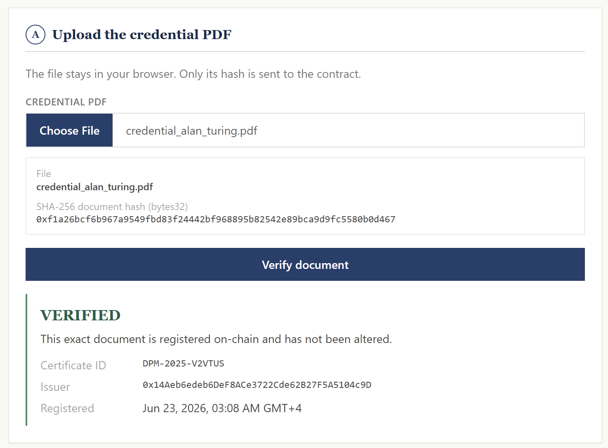
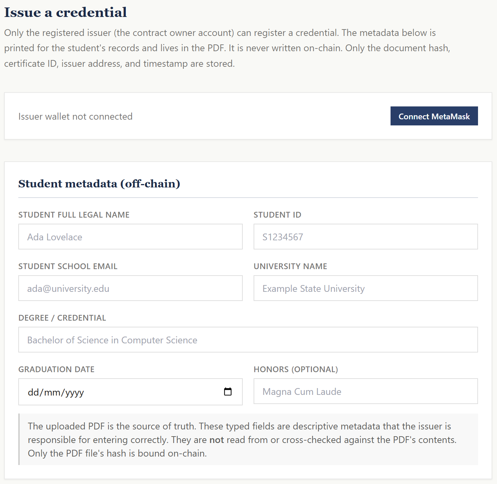
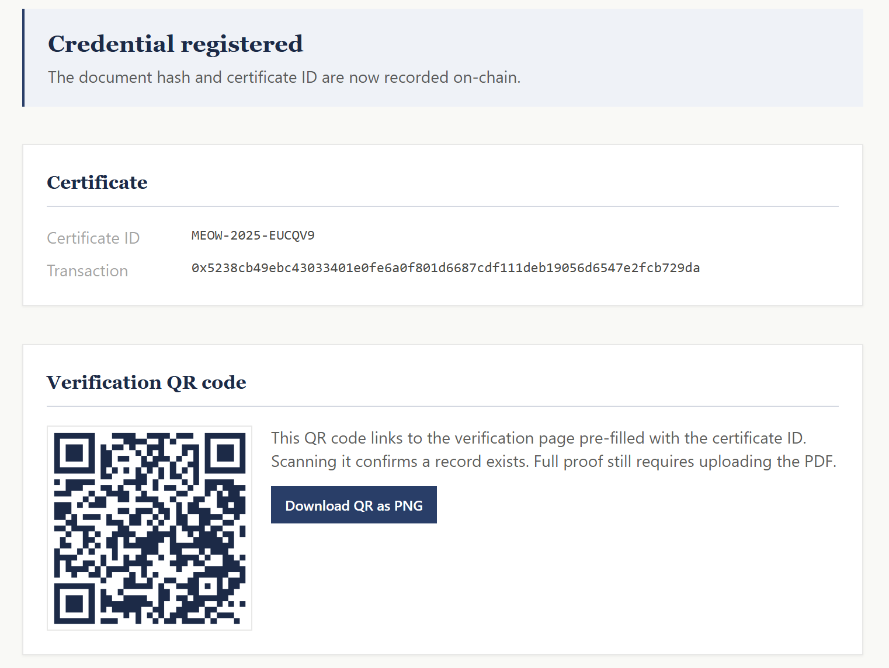

# VeriCred: Blockchain Academic Credential Verification

VeriCred lets an institution register an academic credential (Bachelor's, Master's, or PhD) on a public blockchain, and lets anyone verify that a credential document is authentic and unaltered, without trusting a central database or contacting the issuer.

The core idea: **the institution decides what is genuine, and the blockchain makes that decision tamper-evident.** A credential PDF is hashed in the browser, and only the hash, a certificate ID, the issuer's address, and a timestamp are written on-chain. The personal details never leave the document.

**Live demo:** https://vericred-zeta.vercel.app/
**Live contract (Polygon Amoy):** [`0xa5Fa1cdD2881437EDEcaf2387bE41D9543D260b4`](https://amoy.polygonscan.com/address/0xa5Fa1cdD2881437EDEcaf2387bE41D9543D260b4)

## How it works

**Issue (institution).** The registrar fills in the credential metadata and uploads the credential PDF. The browser computes the SHA-256 hash of the file, generates a unique certificate ID, and the issuer account writes the record on-chain via MetaMask. A QR code encoding the verification link is produced for the credential holder.

**Verify (employer).** Three entry points, two tiers of trust:

- **Upload the PDF.** The file is re-hashed and checked against the chain. A match proves the exact document is registered and unaltered. This is the cryptographic proof.
- **Enter the certificate ID, or scan the QR code.** This looks up whether a record with that ID exists on-chain. It confirms a record exists, but not that a given PDF matches it; only the hash check does that. The interface prompts for a PDF upload to complete the proof.

## Privacy by design

No personal data is written to the blockchain. A public ledger is the wrong place for names, student IDs, or emails, so those live only in the PDF and in the interface. On-chain, each record holds only the document hash, the certificate ID, the issuer address, and the timestamp. This keeps the system aligned with data-protection norms while still making the credential tamper-evident.

## What it proves, and what it does not

VeriCred proves that a credential was registered by a specific issuer address and has not been altered since. It does **not** verify the real-world legitimacy of the issuer itself; trust roots in which issuer address you believe. In a production setting, the issuer address would belong to a recognized institution (the same model used by university blockchain-credential systems such as MIT's Blockcerts). The typed metadata is entered by the issuer and is not parsed from the PDF; the cryptographic guarantee is bound to the file, not the form.

## Tech

- **Smart contract.** Solidity, OpenZeppelin Ownable, deployed to Polygon Amoy. Stores hash-to-record mappings keyed by both document hash and certificate ID. Owner-only issuance, duplicate-hash and duplicate-ID prevention, events on registration.
- **Tests.** Hardhat (Mocha/chai), covering registration, duplicate prevention, owner restriction, and both lookup paths.
- **Frontend.** Next.js (App Router), TypeScript, Tailwind. In-browser SHA-256 hashing (Web Crypto), MetaMask via ethers v6, client-side QR generation, human-readable error handling for gas, revert, and network conditions.

## Run locally

Install and test the contract:

    npm install
    npx hardhat test

To run against a local chain, start a node, deploy, and run the frontend:

    npx hardhat node
    npx hardhat run scripts/deploy.js --network localhost
    cd frontend && npm install && npm run dev

The verify side reads from the public Amoy contract and needs no wallet. The issue side requires MetaMask with the issuer account and a small amount of test POL for gas.

## Disclaimer

A demonstration and education project, not a production credential authority. It proves document integrity and provenance since registration. It does not establish the real-world authority of the issuer, and a successful verification means the document matches a registered record, not that the issuing institution is itself accredited.